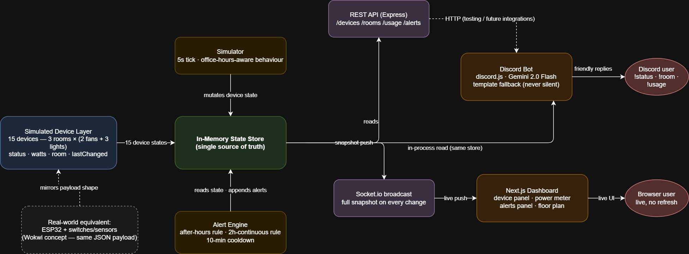

# OfficeWatch — Lights, Fans, Discord: Solved 🏢⚡

Real-time office energy monitoring: a live web dashboard + an AI-powered Discord
bot, fed by one simulated IoT device layer through a single backend.

> **Techathon Nationals 2026 — Preliminary Round** · Team **Zero2One** (Shahriar Hossain Arafat)

**Demo video:** _(added before submission)_

---

## The Problem

A small office runs on Discord — but lights and fans stay on after everyone
leaves, and the electricity bill climbs silently. The boss wants three things:
see every device live on a dashboard, know how much power is burning, and ask
a bot about it right from Discord.

**Office setup (fixed by the problem):** 3 rooms (Drawing Room, Work Room 1,
Work Room 2) × (2 fans + 3 lights) = **15 devices**.

## The Solution

One Node.js process owns the truth. A simulator plays the role of real
hardware, an in-memory store holds device state, and both interfaces — the
Next.js dashboard and the Discord bot — read from that same store. They can
never disagree.
[Simulated Device Layer] → [In-Memory Store] → [REST API + Socket.io] → [Dashboard]
└────────── (in-process read) ────→ [Discord Bot] → Gemini



## Features

**Dashboard** (`localhost:3000`)
- Live device panel — all 15 devices by room, ON/OFF state, no page refresh (Socket.io push)
- Live power meter — office total + per-room watts + today's estimated kWh
- Timestamped alerts panel — after-hours devices, rooms fully on for 2+ hours
- **Bonus:** animated SVG floor plan matching the official layout — lights glow, fans spin, per-room watt totals

**Discord bot** (`OfficeWatch`)
- `!status` — whole-office summary · `!room <drawing|work1|work2>` — one room · `!usage` — power + kWh · `!help`
- Replies are humanized by **Gemini 2.0 Flash**, grounded strictly in live store data
- **Bonus:** proactively posts alerts to a designated channel the moment they trigger

## AI Integration

- **Model:** Google Gemini 2.0 Flash via `@google/generative-ai`
- **Approach:** the backend computes facts (JSON) from the store; Gemini only
  phrases them conversationally. The prompt forbids inventing numbers — data
  and language are strictly separated.
- **Edge cases:** if the API key is missing, the call fails, rate-limits, or
  returns empty, the bot falls back to deterministic English templates — it
  never goes silent and never fabricates data. Multi-line messages are handled
  by parsing the first line as the command.

## IoT Design (simulated, honestly)

No physical hardware in this round. The device layer is an honest simulation:

- **Wokwi circuit (one representative room):** ESP32 reads 5 device states
  (2 fans + 3 lights) via `INPUT_PULLUP` switch taps (stand-ins for
  relay/optocoupler sensing), mirrors each on a status LED through 220Ω
  resistors, and prints the exact JSON payload our backend uses.
  Live simulation: **[Wokwi project](WOKWI_LINK_এখানে)** · files in [`diagrams/wokwi/`](diagrams/wokwi/)
- **Simulator:** office-hours-aware behaviour (busy 9–5, occasional
  "forgotten" devices after hours), 5s tick, per-device wattage, kWh
  integration by time-sampling. The payload shape is identical to the ESP32's
  serial output — swapping simulation for real hardware means changing the
  producer, nothing downstream.

## Tech Stack

Node.js · Express 5 · Socket.io · discord.js v14 · Google Gemini 2.0 Flash ·
Next.js 16 · React · Tailwind CSS · Wokwi (ESP32) · draw.io

## Setup & Run

Prereqs: Node 18+, a Discord bot token, a Gemini API key.

```bash
git clone https://github.com/ShArafat58/Techathon2026-Zero2One.git
cd Techathon2026-Zero2One

# 1) Backend + bot
cd server
npm install
# create server/.env :
#   DISCORD_TOKEN=your_bot_token
#   GEMINI_API_KEY=your_gemini_key
#   DISCORD_ALERT_CHANNEL_ID=channel_id_for_proactive_alerts   (optional)
#   PORT=4000
npm start        # API + Socket.io on :4000, bot logs in

# 2) Dashboard (new terminal)
cd ../dashboard
npm install
npm run dev      # http://localhost:3000
```

Discord bot needs **MESSAGE CONTENT INTENT** enabled and permissions:
View Channels, Send Messages, Read Message History.

## API Endpoints

| Endpoint | Returns |
|---|---|
| `GET /api/devices` | all 15 devices with live state |
| `GET /api/rooms` | rooms with their devices |
| `GET /api/rooms/:id` | one room (`drawing`/`work1`/`work2`) |
| `GET /api/usage` | total watts, per-room watts, today's kWh |
| `GET /api/alerts` | timestamped alert feed |

Socket.io event `snapshot` pushes `{devices, usage, alerts}` on every change.

## Project Structure
server/     src/state (store) · src/simulator · src/alerts · src/api · src/bot
dashboard/  Next.js app — page.js + components/FloorPlan.js
diagrams/   system-diagram (drawio+png) · wokwi/ (diagram.json, sketch.ino) · screenshots

## Attributions

- [Google Gemini API](https://ai.google.dev/) — conversational replies (per Gemini API ToS)
- [discord.js](https://discord.js.org/) · [Socket.io](https://socket.io/) · [Express](https://expressjs.com/)
- [Next.js](https://nextjs.org/) · [React](https://react.dev/) · [Tailwind CSS](https://tailwindcss.com/)
- [Wokwi](https://wokwi.com/) — ESP32 circuit simulation · [draw.io](https://app.diagrams.net/) — system diagram
- All application code written during the 24h window by Team Zero2One.